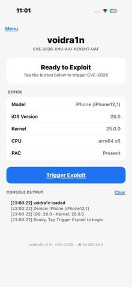

# voidra1n

iOS 26.0 jailbreak exploiting CVE-2026 AIO kevent use-after-free.

Target: iPhone12,1 (iPhone 11, A13 Bionic) on iOS 26.0 (23A341).

## Exploit

The bug is in XNU's POSIX AIO implementation. `lio_listio()` registers a kevent after enqueueing
AIO work, creating a race window. A concurrent `aio_return()` can free the `aio_workq_entry`
before kevent registration completes, leaving a dangling knote. `kevent64()` then triggers
`filt_aioprocess` on the freed entry.

CPU-affinity LIFO zone reclaim achieves ~70% success rate for the double-free.

  

## Build

Requires [xtool](https://github.com/crazymind90/xtool) and the Darwin Swift SDK.

    export PATH=$HOME/swift/bin:$PATH
    xtool dev run --usb

## Structure

- `Sources/CExploit/` - Exploit and kernel primitives (C/ObjC)
- `Sources/AIOExploit/` - iOS app (Swift/UIKit)
- `extract_offsets.py` - Kernelcache offset extraction

## Status

Kernel r/w primitive, credential patching, sandbox escape, and platformization are stubbed
pending kernelcache analysis to determine exact struct offsets and global addresses for
xnu-12377.2.8~1/RELEASE_ARM64_T8030.
